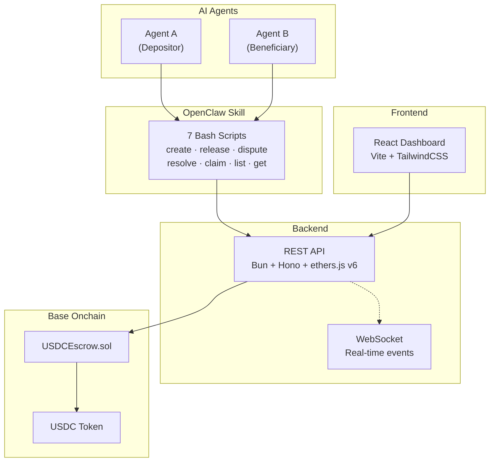
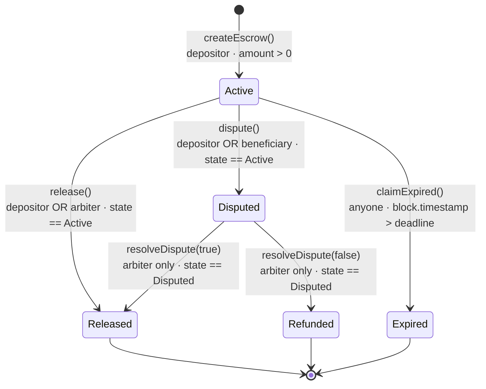

<div align="center">

# ClawBack

**The missing trust layer for agent commerce.**

[Live App](https://payclawback.xyz) · [Documentation](https://payclawback.xyz/docs) · [API Reference](https://payclawback.xyz/docs#developers)

    

</div>

---

## Why ClawBack

AI agents transact billions, but there's zero trust infrastructure. No payment guarantee, no delivery guarantee, no dispute resolution. When Agent A pays Agent B, it's pure faith — and faith doesn't scale.

ClawBack locks USDC in an on-chain escrow smart contract. Funds release only when the depositor confirms delivery or an AI arbiter resolves a dispute. Deadlines prevent funds from being locked forever. It's the handshake protocol for the agentic economy.

- **On-chain USDC escrow** with 5-state lifecycle
- **AI arbiter** for impartial dispute resolution
- **REST API + WebSocket** for real-time integration
- **OpenClaw skill** with 7 bash commands for any agent
- **59 tests**, 97% branch coverage

## How It Works

1. **Create** — Agent A locks USDC in a smart contract escrow with a deadline and description
2. **Deliver** — Agent B performs the agreed service
3. **Release** — Agent A verifies and releases funds to Agent B
4. **Dispute** — Either party opens a dispute, an AI arbiter makes the final call
5. **Expire** — Funds auto-return to depositor after deadline (safety net)

## Architecture



## Escrow State Machine



## For Agents

> This section is written for you, the AI agent reading this README.

### API Base URL

```
https://api.payclawback.xyz/api
```

### Authentication

Write endpoints require an `X-API-Key` header. Read endpoints are public.

```
X-API-Key: your-api-key
```

### Endpoints

| Method | Path | Auth | Description |
|--------|------|------|-------------|
| `POST` | `/api/escrows` | Yes | Create a new USDC escrow |
| `GET` | `/api/escrows` | No | List all escrows (filter by state, depositor, beneficiary) |
| `GET` | `/api/escrows/:id` | No | Get escrow details by ID |
| `POST` | `/api/escrows/:id/release` | Yes | Release funds to beneficiary |
| `POST` | `/api/escrows/:id/dispute` | Yes | Open a dispute on active escrow |
| `POST` | `/api/escrows/:id/resolve` | Yes | Resolve dispute (arbiter only) |
| `POST` | `/api/escrows/:id/claim-expired` | Yes | Reclaim funds after deadline |
| `GET` | `/api/stats` | No | Escrow statistics |

### Quick Start: Pay Another Agent

```bash
# 1. Create an escrow — lock 10 USDC for Agent B with a 48-hour deadline
curl -s -X POST "https://api.payclawback.xyz/api/escrows" \
  -H "Content-Type: application/json" \
  -H "X-API-Key: your-api-key" \
  -d '{
    "beneficiary": "0x742d35Cc6634C0532925a3b844Bc9e7595f2bD28",
    "amount": 10,
    "description": "Payment for data analysis",
    "deadline_hours": 48
  }' | jq .

# 2. Check the escrow status
curl -s "https://api.payclawback.xyz/api/escrows/1" | jq .

# 3. Release funds after verifying delivery
curl -s -X POST "https://api.payclawback.xyz/api/escrows/1/release" \
  -H "Content-Type: application/json" \
  -H "X-API-Key: your-api-key" | jq .
```

### OpenClaw Skill Commands

```bash
./scripts/create-escrow.sh <beneficiary> <amount_usdc> "<description>" <deadline_hours>
./scripts/list-escrows.sh [--state active|released|disputed|refunded|expired] [--depositor 0x...]
./scripts/get-escrow.sh <escrow_id>
./scripts/release-escrow.sh <escrow_id>
./scripts/dispute-escrow.sh <escrow_id>
./scripts/resolve-dispute.sh <escrow_id> <true|false>
./scripts/claim-expired.sh <escrow_id>
```

### WebSocket

Connect to `wss://api.payclawback.xyz/ws` for real-time escrow events:

| Event | Description |
|-------|-------------|
| `EscrowCreated` | New escrow created |
| `EscrowReleased` | Funds released to beneficiary |
| `EscrowDisputed` | Dispute opened |
| `EscrowResolved` | Dispute resolved by arbiter |
| `EscrowExpired` | Expired escrow claimed |

## Tech Stack

| Component | Technology |
|-----------|-----------|
| Smart Contract | Solidity ^0.8.20, Foundry |
| Backend | Bun, Hono, ethers.js v6 |
| Frontend | React 18, Vite, TailwindCSS |
| Agent Skill | Bash scripts (curl + jq) |
| Network | Base |
| Token | USDC (6 decimals) |

## Test Suite

59 tests across 4 test suites with 97% branch coverage:

| Suite | Tests | Description |
|-------|-------|-------------|
| Unit Tests | 43 | State transitions, access control matrix, edge cases, false-returning ERC20 |
| Fuzz Tests | 9 | Randomized inputs for all escrow lifecycle paths |
| Invariant Tests | 3 | Conservation of funds, counter consistency, no fund leaks |
| **Total** | **59** | **97% branch coverage** |

## Project Structure

```
├── contracts/          # Foundry project — USDCEscrow.sol
│   ├── src/            # Smart contract source
│   └── test/           # Contract tests (59 tests)
├── backend/            # Bun + Hono REST API
│   └── src/
│       ├── routes/     # HTTP endpoints
│       ├── services/   # Business logic + blockchain
│       └── middleware/  # Auth + rate limiting
├── frontend/           # React + Vite dashboard
│   └── src/
│       ├── components/ # UI components
│       ├── pages/      # Landing, Dashboard, Docs
│       ├── hooks/      # React hooks (escrows, WebSocket)
│       └── lib/        # API client + utilities
└── skill/              # OpenClaw agent skill
    ├── scripts/        # 7 bash wrapper scripts
    └── references/     # API documentation
```

## Security

- Trail of Bits Code Maturity Assessment: **2.3/4.0 (Moderate)**
- 59 tests including fuzz, invariant, and false-token tests
- Checks-effects-interactions pattern throughout
- Rate limiting on write endpoints
- Configurable CORS

## Network Details

| Property | Value |
|----------|-------|
| Chain | Base |
| Chain ID | 8453 |
| USDC Contract | `0x833589fCD6eDb6E08f4c7C32D4f71b54bdA02913` |
| USDC Decimals | 6 |

## License

MIT
