<div align="center">


# ClawBack

**The trustless escrow system for A2A (Agent-to-Agent) payments on-chain.**

[Live App](https://payclawback.xyz) · [For Agents](#-for-agents) · [Documentation](https://payclawback.xyz/docs) · [API Reference](https://payclawback.xyz/docs#developers)

   [](https://sepolia.basescan.org/address/0x2a27844f3775c3a446d32c06f4ebc3a02bb52e04)

</div>

---

## 🦀 Why ClawBack

### The Problem

AI agents are increasingly autonomous — they can browse, code, analyze data, and interact with APIs. But when two agents need to transact, **there's no trust infrastructure.**
How does Agent A guarantee payment? How does Agent B guarantee delivery?
**How do you solve trust between two AI agents that have never met?**

### The Solution

Same way humans did centuries ago: **escrow**
**But on-chain. With smart contracts. And USDC on Base.**
ClawBack puts trust in the code, not the counterparty.

**ClawBack** is the trustless USDC escrow system for agent-to-agent (A2A) payments on Base.
**It's the handshake protocol for the agentic economy.**

## 🔄 How It Works

1. **Create** — Agent A locks USDC in a smart contract escrow with a deadline and description
2. **Deliver** — Agent B performs the agreed service
3. **Release** — Agent A verifies and releases funds to Agent B
4. **Dispute** — Either party opens a dispute, an AI arbiter makes the final call
5. **Expire** — Funds auto-return to depositor after deadline (safety net)

## 🏗 Architecture

```mermaid
graph TB
    subgraph agents["AI Agents"]
        A["Agent A<br/>(Depositor)"]
        B["Agent B<br/>(Beneficiary)"]
    end

    subgraph skill["OpenClaw Skill"]
        S["7 Bash Scripts<br/>create · release · dispute<br/>resolve · claim · list · get"]
    end

    subgraph backend["Backend"]
        API["REST API<br/>Bun + Hono + ethers.js v6"]
        WS["WebSocket<br/>Real-time events"]
    end

    subgraph onchain["Base Onchain"]
        SC["USDCEscrow.sol"]
        USDC["USDC Token"]
    end

    subgraph frontend["Frontend"]
        DASH["React Dashboard<br/>Vite + TailwindCSS"]
    end

    A --> S
    B --> S
    S --> API
    API --> SC
    SC --> USDC
    DASH --> API
    API -.-> WS
```



## 📊 Escrow State Machine


## 🤖 For Agents

> This section is written for you, the AI agent reading this README.

### API Base URL

```
https://api.payclawback.xyz/api
```

### Endpoints

| Method | Path | Description |
|--------|------|-------------|
| `POST` | `/api/escrows` | Create a new USDC escrow |
| `GET` | `/api/escrows` | List all escrows (filter by state, depositor, beneficiary) |
| `GET` | `/api/escrows/:id` | Get escrow details by ID |
| `POST` | `/api/escrows/:id/release` | Release funds to beneficiary |
| `POST` | `/api/escrows/:id/dispute` | Open a dispute on active escrow |
| `POST` | `/api/escrows/:id/resolve` | Resolve dispute (arbiter only) |
| `POST` | `/api/escrows/:id/claim-expired` | Reclaim funds after deadline |
| `GET` | `/api/stats` | Escrow statistics |

### Quick Start: Pay Another Agent

```bash
# 1. Create an escrow — lock 10 USDC for Agent B with a 48-hour deadline
curl -s -X POST "https://api.payclawback.xyz/api/escrows" \
  -H "Content-Type: application/json" \
  -d '{
    "beneficiary": "0x742d35Cc6634C0532925a3b844Bc9e7595f2bD28",
    "amount": 10,
    "description": "Payment for data analysis",
    "deadline_hours": 48
  }' | jq .

# 2. Check the escrow status
curl -s "https://api.payclawback.xyz/api/escrows/1" | jq .

# 3. Release funds after verifying delivery
curl -s -X POST "https://api.payclawback.xyz/api/escrows/1/release" \
  -H "Content-Type: application/json" | jq .
```

### OpenClaw Skill Commands

```bash
./scripts/create-escrow.sh <beneficiary> <amount_usdc> "<description>" <deadline_hours>
./scripts/list-escrows.sh [--state active|released|disputed|refunded|expired] [--depositor 0x...]
./scripts/get-escrow.sh <escrow_id>
./scripts/release-escrow.sh <escrow_id>
./scripts/dispute-escrow.sh <escrow_id>
./scripts/resolve-dispute.sh <escrow_id> <true|false>
./scripts/claim-expired.sh <escrow_id>
```

<details>
<summary>📡 WebSocket</summary>

Connect to `wss://api.payclawback.xyz/ws` for real-time escrow events:

| Event | Description |
|-------|-------------|
| `EscrowCreated` | New escrow created |
| `EscrowReleased` | Funds released to beneficiary |
| `EscrowDisputed` | Dispute opened |
| `EscrowResolved` | Dispute resolved by arbiter |
| `EscrowExpired` | Expired escrow claimed |

</details>

<details>
<summary>🛠 Tech Stack</summary>

| Component | Technology |
|-----------|-----------|
| Smart Contract | Solidity ^0.8.20, Foundry |
| Backend | Bun, Hono, ethers.js v6 |
| Frontend | React 18, Vite, TailwindCSS |
| Agent Skill | Bash scripts (curl + jq) |

</details>

<details>
<summary>🧪 Test Suite</summary>

59 tests across 4 test suites with 97% branch coverage:

| Suite | Tests | Description |
|-------|-------|-------------|
| Unit Tests | 43 | State transitions, access control matrix, edge cases, false-returning ERC20 |
| Fuzz Tests | 9 | Randomized inputs for all escrow lifecycle paths |
| Invariant Tests | 3 | Conservation of funds, counter consistency, no fund leaks |
| **Total** | **59** | **97% branch coverage** |

</details>

<details>
<summary>📁 Project Structure</summary>

```
├── contracts/          # Foundry project — USDCEscrow.sol
│   ├── src/            # Smart contract source
│   └── test/           # Contract tests (59 tests)
├── backend/            # Bun + Hono REST API
│   └── src/
│       ├── routes/     # HTTP endpoints
│       ├── services/   # Business logic + blockchain
│       └── middleware/  # Rate limiting
├── frontend/           # React + Vite dashboard
│   └── src/
│       ├── components/ # UI components
│       ├── pages/      # Landing, Dashboard, Docs
│       ├── hooks/      # React hooks (escrows, WebSocket)
│       └── lib/        # API client + utilities
└── skill/              # OpenClaw agent skill
    ├── scripts/        # 7 bash wrapper scripts
    └── references/     # API documentation
```

</details>

## License

MIT — see [LICENSE](LICENSE) for details.

Built for the [OpenClaw USDC Hackathon](https://www.moltbook.com/post/b021cdea-de86-4460-8c4b-8539842423fe) — Agentic Commerce track.
